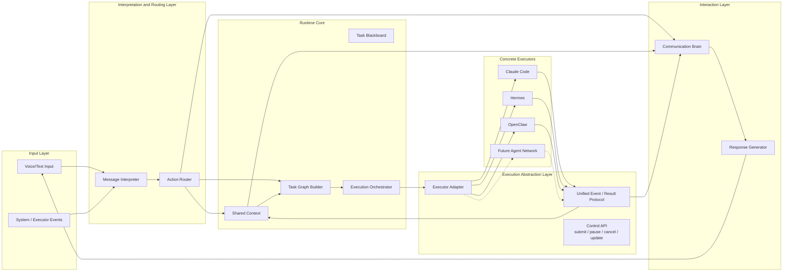

# Synapse Design

> Legacy v1 architecture reference.  
> Current stable design work should follow `docs/architecture/`, `docs/protocol/`, and `docs/roadmap/`.

## Overview

Synapse is a backend-first prototype for a `communication brain + execution brain` runtime.

The core idea is that language-facing interaction and task-facing execution should be decoupled:

- `Communication Brain`
  - Owns acknowledgement, clarification, conversational continuity, and user-facing status.
- `Execution Brain`
  - Owns task lifecycle, executor routing, control commands, and normalized execution events.
- `Shared Blackboard`
  - Holds the synchronized session state used by both brains.
- `Protocols`
  - Define the stable contracts between user input, routing, task state, execution events, and streamed output.

This prototype is designed as:

- `Runtime V1 = single executor`
- `Protocol V1 = multi-executor ready`
- `Frontend V1 = separate React + Vite demo workspace`
- `Backend package root = runtime/`

## Architectural Goals

- Make the conceptual split explicit in code and protocol design.
- Support perceived concurrency: the system can acknowledge and converse while tasks continue asynchronously.
- Keep executor-specific behavior behind a normalized adapter layer.
- Preserve future extension points for multiple executors and task graphs without complicating V1 runtime behavior.

## Architecture Diagram

## Top-Level Modules

The backend code now lives under the `runtime/` package root.

### `communication_brain`

Responsible for user-facing interaction semantics.

- `interaction_policy.py`
  - Builds the initial communication action for a routed message.
- `event_to_response.py`
  - Maps execution events into communication-brain responses.
- `response_generator.py`
  - Produces user-facing text from typed communication actions.

### `execution_brain`

Responsible for task orchestration and executor coordination.

- `orchestrator.py`
  - Applies routed actions, mutates task state, starts/resumes/cancels work, and emits normalized events.
- `task_graph.py`
  - Builds task objects from routed actions.
- `executor_adapter_router.py`
  - Selects which executor adapter should handle a task.
- `event_normalizer.py`
  - Applies execution events back onto task state.

### `shared_blackboard`

Responsible for synchronized runtime state.

- `blackboard_state.py`
  - Defines blackboard session state across shared context and task-blackboard data.
- `mutations.py`
  - Applies context patches, task updates, and control transitions.
- `runtime_state.py`
  - Manages sessions, snapshots, subscriptions, and ordered stream events.

### `action_router`

Responsible for translating one user message into multiple structured effects.

- `action_router.py`
  - Calls the message interpreter and returns `RoutingDecision + ActionBundle`.
- `resolver.py`
  - Resolves implicit task references to concrete tasks.
- `priorities.py`
  - Sorts actions so control/update work happens before lower-priority work.

### `protocols`

Defines the conceptual contracts.

- `conversation.py`
- `runtime.py`
- `tasks.py`
- `execution.py`
- `stream.py`

### `executors`

Defines concrete execution implementations.

- `base.py`
  - Async executor contract.
- `bootstrap.py`
  - Registry composition and default-executor selection.
- `external_backend.py`
  - Generic boundary for external worker integrations.
- `external.py`
  - Generic adapter that converts external backend results into normalized execution events.
- `registry.py`
  - Executor registry.
- `mock/`
  - Mock executor package used in V1.
- `codex/`
  - Codex-specific backend and executor adapter, isolated from core runtime files.

### `api`

Thin transport layer.

- `POST /sessions`
- `GET /sessions/{session_id}`
- `GET /sessions/{session_id}/tasks`
- `POST /sessions/{session_id}/messages`
- `POST /sessions/{session_id}/commands`
- `WS /sessions/{session_id}/stream`
- `WS /sessions/{session_id}/trace`

### `frontend`

Separate minimal React + Vite experience layer.

- one single-screen demo
- chat-first interaction
- live task cards
- ordered runtime event feed
- dedicated trace flow panel
- basic task controls

## Protocol Model

### Conversation Protocol

Defines what the communication brain receives and emits.

- `UserMessage`
  - raw user input
- `ConversationAction`
  - typed communication intent such as `acknowledge`, `chat_reply`, `clarify`, `inform_progress`, `inform_done`
- `CommunicationEvent`
  - emitted communication event

The runtime may also emit transient partial communication updates over the live websocket while a response is being generated. Those partial chunks are not persisted in session history; only the final communication event is durable.

The communication layer is typed first. Rendered text is derived from typed actions, not used as the source of truth.

### Runtime Protocol

Defines how one message can produce multiple coordinated system effects.

- `RoutingDecision`
  - high-level routing outcome
- `ActionBundle`
  - list of structured runtime actions produced from one message
- `RuntimeAction`
  - action types:
    - `create_task`
    - `update_task`
    - `control_task`
    - `apply_context_patch`
    - `emit_conversation_action`
- `ContextPatch`
  - scoped shared-state patch

This is where the “one utterance, multiple effects” concept is encoded.

Message outcomes should be treated as four distinct cases:

- new task
- task update/control
- conversation-only
- clarification

`clarify` should only be used when task/control intent exists but cannot be resolved safely. `conversation-only` is reserved for social chat, subjective or persona-directed questions the agent can answer directly, and meta questions about Synapse itself. `create_task` requests default to requiring a real executor, but the action bundle may explicitly mark a task as mock-safe through `input_context.requires_executor_capability = false`. If only the mock executor is active, capability-gated task creation should fail clearly instead of producing fake-success task output.

Response generation should operate from the agent’s perspective, using the typed action plus all supplied context, instead of mechanically rewriting a thin action shell.

Natural-language control requests should also respect executor capabilities. If a message asks to pause or resume a task on an executor that does not support that command, the runtime should answer conversationally instead of raising a transport-level failure.

User-facing communication and stored task output have different goals:

- communication replies should be concise, narrative, and suitable for spoken delivery
- full task results should remain available on the task board, preferably from task artifacts rather than the shorter spoken summary

### Task Protocol

Defines the task lifecycle and future-safe task identity model.

- `Task`
  - includes:
    - `task_id`
    - `root_task_id`
    - `parent_task_id`
    - `assigned_executor`
    - `candidate_executors`
    - `capability_tags`
    - `depends_on_task_ids`
- `TaskReference`
  - supports implicit and explicit targeting
- `TaskMutation`
- `ControlCommand`

The important future hooks are:

- `root_task_id`
- `parent_task_id`
- `assigned_executor`
- `candidate_executors`
- `depends_on_task_ids`

These keep the schema compatible with later multi-executor or subtask flows.

Runtime task creation is fail-fast: a `create_task` action must resolve to a non-empty `goal`, and to a non-empty `title` after runtime derivation. Malformed interpreter output should be rejected before task creation rather than normalized into blank task content.

### Execution Protocol

Defines the executor adapter boundary.

- `ExecutorCapability`
- `ExecutionRequest`
- `ExecutionEvent`
- `ExecutionResult`
- `Artifact`

Executors are expected to emit normalized execution events rather than leaking executor-native state into the communication layer.
Executor-native activity streams may be richer than the public protocol; adapters must collapse them back into `ExecutionEvent` updates instead of exposing backend-specific event schemas. Mid-run executor activity can be published as transient execution stream events while terminal lifecycle state remains durable.

### Stream Protocol

Defines the unified ordered stream to clients.

- `StreamEvent`
  - categories:
    - `communication`
    - `task`
    - `execution`
    - `context`
    - `system`
- `SessionSnapshot`

The stream is intentionally unified so clients consume one ordered event channel instead of stitching multiple streams together.

### Trace Protocol

Defines the separate causality-oriented trace stream.

- `TraceEvent`
- `TraceSnapshot`

The trace stream is intentionally separate from the outcome stream so module-level diagnostics do not pollute the main product-facing event feed.
LLM-oriented trace payloads may include latency diagnostics such as `duration_ms`, and true streaming responses may also include `ttfb_ms`.
`response_render_completed` may include a nested `llm_response` summary so the orchestrator-level trace shows the final rendered text and latency in one event.

## Shared Blackboard

The blackboard is the single source of truth for a session.

Conceptually it contains two closely related parts:

- `Shared Context`
  - conversation state
  - strategy state
- `Task Blackboard`
  - task registry
  - pending clarifications
  - event history and sequence tracking

It currently stores:

- `conversation_state`
- `task_registry`
- `strategy_state`
- `pending_clarifications`
- `event_log`
- `last_sequence`

`conversation_state` now also carries a bounded `message_history` for LLM context. It stores the latest 30 persisted user/assistant messages. Transient streamed response chunks are excluded; only final assistant messages are durable history. The message interpreter should consume only a compact slice of recent history plus clarification, active-task, and executor-capability context, rather than serializing the full session snapshot into every interpreter request. Active-task context should stay minimal, exposing only active `task_id` and `goal` pairs for tasks in `queued`, `running`, or `blocked` states. Its Structured Outputs schema should stay lean, with a compact action object that avoids unnecessary padding fields, and its static prompt prefix should remain stable so prompt caching can reduce repeated interpreter latency.

The message interpreter should treat the LLM's structured routing result as authoritative once it passes schema validation. Local code should enforce structural integrity, not reclassify social chat into tasks or vice versa after the model responds.

Task completion replies should be rendered from the originating task thread, not from the latest unrelated session chat. Task-related user messages should be associated back to their resolved `task_id`, and terminal task replies should use task-scoped history plus the task's originating user message as response context.

`update_task` actions should carry a concrete non-empty `goal`. If an update resolves to a `blocked` task, the runtime may continue that task in place. If the targeted task has already become `done`, the runtime should preserve the completed task and create a new task from the update payload instead of restarting the old one. Explicit `retry_task` remains limited to retryable non-completed terminal states.

The communication brain and execution brain do not share state directly. They synchronize through the blackboard and protocol events.

## Runtime Flow

### Message Handling

1. Client sends `UserMessage`.
2. `ActionRouter` produces `RoutingDecision + ActionBundle`.
3. `Communication Brain` emits an immediate acknowledgement or clarification.
4. `Execution Brain` applies the action bundle.
5. `Shared Blackboard` stores mutations and publishes stream events.
6. Executor runs asynchronously and emits execution events.
7. `Communication Brain` converts relevant execution events into user-facing communication events.

### Control Handling

The runtime supports:

- `cancel_task`
- `retry_task`

Priority rules are deterministic:

1. cancel
2. update existing task
3. clarification
4. create new task
5. low-priority conversation feedback

## Executor Integrations

V1 keeps one in-process mock executor and adds an optional Codex-backed executor through the same normalized executor contract. When Codex is enabled and no explicit default is configured, new tasks use Codex by default while the mock remains registered for fallback and testing.

The mock executor simulates:

- `accepted`
- `started`
- `progress`
- `blocked`
- `completed`
- `canceled`

This keeps the runtime behavior observable without depending on an external tool or agent, but it is not the intended default path for capability-gated question answering. When only the mock executor is active, capability-gated questions should be blocked with a clear user-facing message rather than simulated as successful answers.

The Codex executor:

- is registered independently from the mock executor
- becomes the effective default executor when enabled unless another valid default is explicitly configured
- is isolated behind a generic external-backend adapter layer
- emits the same normalized `ExecutionEvent` protocol as any other executor
- consumes `codex exec --json` internally, but translates Codex JSONL activity back into normalized execution updates instead of exposing Codex-native event types
- uses transient `execution` stream events for meaningful in-flight agent activity while keeping final lifecycle outcomes on the durable execution history
- exposes capabilities so the UI can disable unsupported controls such as pause/resume
- keeps Codex-specific subprocess and prompt logic out of the execution brain and main app bootstrap

## V1 Scope

Included:

- FastAPI backend runtime
- separate React + Vite frontend demo
- chat-first UI for communication events
- streamed assistant text over the live websocket
- task cards with pause, resume, and cancel controls
- live activity feed with expandable event payloads, excluding transient `response_chunk` noise from the operator-facing feed/export

Included:

- FastAPI service
- in-memory blackboard
- typed protocols
- message routing
- implicit task resolution
- executor registry
- one mock executor
- one optional Codex-backed executor integration
- Codex-first task execution when enabled
- HTTP endpoints
- WebSocket event stream
- unit and integration tests for runtime behavior

Not included:

- persistence
- authentication
- production LLM integration
- real voice I/O
- distributed runtime coordination
- multi-executor scheduling

## Future Extension Path

The runtime is intentionally simple, but the schema is designed for future growth.

### Multi-Executor Evolution

Future versions can support:

- multiple registered executors
- executor selection by capability
- task fan-out into child tasks
- different executors handling different subtasks
- normalized event aggregation across executors

The existing schema already reserves the key fields needed for this:

- `assigned_executor`
- `candidate_executors`
- `root_task_id`
- `parent_task_id`
- `depends_on_task_ids`
- `executor_id` on execution events

The current runtime also exposes executor capabilities in session snapshots so transport and UI layers can stay generic while respecting executor-specific control support.

### LLM Evolution

V1 uses heuristic interpretation and response rendering boundaries.

Future versions can replace those with live provider-backed modules for:

- message interpretation
- clarification generation
- response phrasing

The important constraint should remain:

- LLMs may interpret or phrase
- LLMs must not directly own runtime state transitions

## Current Test Coverage

The automated tests currently verify:

- blackboard mutation behavior
- action priority ordering
- task reference resolution
- end-to-end runtime flow from message to completion
- blocked-task resume behavior after follow-up input

## Design Principle

The central design principle is:

`Communication Brain` and `Execution Brain` should evolve independently, while staying synchronized through explicit protocols and a shared blackboard.
