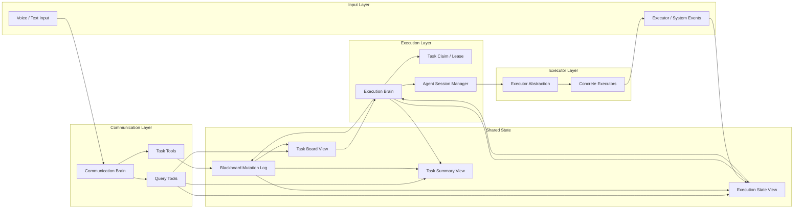

# RFC 0001: Synapse Design V2

This RFC preserves the original long-form `design-v2` proposal.

Its content has been split into the stable docs under:

- `docs/architecture/`
- `docs/protocol/`
- `docs/guides/`
- `docs/decisions/`

When this RFC conflicts with the stable docs, treat the stable docs as authoritative.

# Synapse Design V2

## Overview

This document describes a proposed `v2` runtime architecture for Synapse.

The key design change is:

- remove the standalone `Message Interpreter` from the runtime flow
- keep two core brains:
  - `Communication Brain`
  - `Execution Brain`
- make the `Shared Blackboard` the only shared source of truth

The intended result is:

- lower first-turn latency
- stricter separation between communication and execution
- a more explicit blackboard-centered runtime
- a clearer path toward sessionized agent execution

This document is a design proposal. It does not imply the current code already matches this architecture.

## Core Principle

**Communication Brain owns user intent and task manipulation; Execution Brain owns sessionized execution; Blackboard is the only shared source of truth.**

This principle replaces the current entrance model where one user message is first interpreted by a dedicated routing layer and then expanded into runtime actions.

In `v2`, user messages first enter the `Communication Brain`. The `Communication Brain` decides whether to:

- answer directly
- query task state
- create or update tasks
- issue task control commands

The `Execution Brain` does not consume raw user messages. It consumes structured blackboard state.

## Conversational Commitment over System Acknowledgement

In `v2`, a successful tool call is an internal fact, not a default user-facing utterance.

This means:

- `create_task(...)` succeeding does not imply the reply should be `task created successfully`
- `update_task(...)` succeeding does not imply the reply should be `task updated successfully`
- `control_task(...)` succeeding does not imply the reply should be `command succeeded`

The default interaction target is:

- the user feels heard
- the instruction feels accepted
- the system feels like it has started acting

The default interaction target is **not**:

- replaying internal blackboard operations back to the user

The guiding rule is:

**Communication Brain should acknowledge intent by committing to action, not by reporting internal task operations.**

## Why Remove the Message Interpreter

The main reason to remove the standalone interpreter layer is not conceptual purity. It is operational simplicity.

The expected benefits are:

- lower response latency
  - the runtime no longer needs a separate interpretation pass before task mutation begins
- stronger separation of concerns
  - communication is not mixed with executor dispatch logic
- simpler mental model
  - the system has three first-class runtime actors:
    - communication brain
    - execution brain
    - blackboard
- better executor-runtime shape
  - the execution brain becomes a real task/session runtime rather than a passive receiver of pre-expanded action bundles

The design does **not** remove interpretation entirely. It relocates interpretation into the `Communication Brain`'s internal tool-use decisions.

That distinction matters:

- there is no standalone runtime interpreter module
- but the communication brain still interprets user intent in order to use tools correctly

## Runtime Shape

### Top-Level Components

- `Communication Brain`
  - owns user interaction
  - decides whether and how to manipulate tasks
  - uses built-in task tools to read and write the blackboard
- `Execution Brain`
  - watches runnable tasks on the blackboard
  - claims tasks
  - manages agent sessions
  - executes work
  - writes execution state and summaries back to the blackboard
- `Shared Blackboard`
  - stores the current task board
  - stores mutation and command history
  - stores execution state
  - stores user-facing summaries
  - is the only shared fact layer

### Architecture Diagram



## Brain Responsibilities

## Communication Brain

The `Communication Brain` owns:

- acknowledgement
- clarification
- direct conversational replies
- task reference resolution in conversation
- deciding when to create, update, or control tasks
- querying task summaries or details for user-facing replies
- translating internal tool outcomes into natural conversational commitment

The `Communication Brain` does **not** own:

- executor selection during active execution
- session lifecycle management
- execution progress tracking
- raw execution state interpretation
- low-level executor logs

The `Communication Brain` should not directly inspect raw executor logs. It should rely on stable blackboard query tools.

Unless the user explicitly asks for system state, the `Communication Brain` should also avoid exposing internal runtime terms such as:

- task created
- task updated
- mutation applied
- session bound
- blackboard updated
- query succeeded

## Execution Brain

The `Execution Brain` owns:

- scanning or receiving notifications about runnable tasks
- claiming tasks safely
- assigning and managing agent sessions
- launching and supervising executor work
- updating execution state in real time
- marking tasks blocked, failed, running, or done
- periodically producing summaries back to the blackboard
- releasing, renewing, or re-binding sessions when necessary

The `Execution Brain` does **not** own:

- direct user interaction
- free-form task creation from natural language
- authoritative task decomposition into formal tasks without communication-brain involvement

In `v2`, the execution brain may produce:

- execution state
- blockers
- summaries
- suggested next actions

But it should not directly create or re-prioritize formal tasks on the board.

## Shared Blackboard

The `Shared Blackboard` is the only shared fact layer between the two brains.

Its job is not to be a dumping ground for unstructured text. Its job is to hold structured runtime truth.

If the blackboard becomes a large natural-language scratchpad, then the removed interpreter complexity simply reappears elsewhere. Therefore, `v2` depends on a strongly structured blackboard schema.

## Blackboard Model

The recommended blackboard model is a **dual-layer design**:

1. append-only mutation and command history
2. materialized current views

This balances:

- auditability
- recoverability
- simple reads for communication and execution

### Layer 1: Mutation and Command Log

This layer records:

- task creation mutations
- task update mutations
- task control commands
- execution claims
- execution state transitions
- summary refresh events

This log is the canonical change history.

### Layer 2: Materialized Views

This layer exposes current state for fast reads:

- task board
- execution state
- summary view

Both brains should work primarily against these views, not by replaying raw event history on every request.

## Blackboard Objects

### 1. Task

`Task` is the logical unit of work.

It should contain:

- `task_id`
- `root_task_id`
- `parent_task_id`
- `title`
- `goal`
- `status`
- `priority`
- `requires_confirmation`
- `interruptible`
- `depends_on_task_ids`
- `assigned_executor_preference`
- `session_affinity`
- `task_revision`
- `latest_instruction`
- `created_by`
- `updated_at`

`Task` should represent durable intent.

It should not be the primary home for:

- executor logs
- raw runtime events
- session lifecycle internals

### 2. TaskMutation

`TaskMutation` is the structured write protocol used mainly by the communication brain.

It should contain:

- `mutation_id`
- `task_id`
- `mutation_type`
- `patch`
- `issued_by`
- `urgency`
- `effective_scope`
- `requires_replan`
- `timestamp`

Examples:

- update title
- add constraint
- attach user clarification
- change priority
- mark confirmation provided

### 3. TaskCommand

`TaskCommand` is a structured task-control operation, separate from generic mutation.

It should contain:

- `command_id`
- `task_id`
- `command_type`
- `payload`
- `issued_by`
- `reason`
- `timestamp`

Examples:

- cancel
- retry
- pause
- preempt
- resume
- release session

### 4. ExecutorConfig

`ExecutorConfig` is the normalized executor identity used when dispatching or resuming work.

It should contain:

- `executor_id`
- `variant`
- `model_id`
- `reasoning_id`
- `permission_policy`
- optional executor-specific metadata

This keeps:

- base executor family
- per-run execution override

separate from the durable `Task` object itself.

### 5. AgentResumeHandle

`AgentResumeHandle` is an opaque container for executor-native continuity state.

It should contain:

- `executor_id`
- `session_handle`
- `turn_handle`
- `opaque`

It exists so the execution brain can preserve executor-native continuity without leaking backend-specific session details into:

- task semantics
- communication-brain prompts
- user-facing summaries

### 6. QueuedRunRequest

`QueuedRunRequest` represents the next follow-up execution request that should run after the current active run finishes or blocks.

It should contain:

- `queued_request_id`
- `task_id`
- `executor_config`
- `latest_instruction`
- `requested_by_message_id`
- `created_at`
- `updated_at`

V1 should keep this intentionally simple:

- one queued follow-up per active task/session lineage
- newest queued request replaces the older queued request

### 7. ExecutionSession

`ExecutionSession` is the execution-brain-owned lineage for a task under one base executor family.

It should contain:

- `execution_session_id`
- `task_id`
- `base_executor_id`
- `run_ids`
- `active_run_id`
- `latest_run_id`
- `latest_resume_handle`
- `queued_run_request`
- `created_at`
- `updated_at`

This object answers the question:

- “what execution lineage is currently responsible for this task?”

It is not identical to a low-level executor process or a raw CLI invocation.

### 8. ExecutionRun

`ExecutionRun` is one concrete execution attempt inside an `ExecutionSession`.

It should contain:

- `run_id`
- `execution_session_id`
- `task_id`
- `executor_config`
- `run_reason`
- `status`
- `created_from_message_id`
- `resume_handle_in`
- `resume_handle_out`
- `latest_progress_message`
- `progress_percent`
- `output_summary`
- `artifacts`
- `block_reason`
- `failure_reason`
- `metadata`
- `created_at`
- `started_at`
- `completed_at`
- `updated_at`

The durable `Task` remains the user-visible work item. `ExecutionRun` is the disposable and historical execution record.

### 9. SessionBinding

`SessionBinding` is the materialized blackboard view that describes the current live binding between a task and its active execution session.

It should contain:

- `task_id`
- `execution_session_id`
- `session_id`
- `claimed_by`
- `claim_expires_at`
- `execution_revision`
- `binding_status`
- `created_at`
- `updated_at`

This object exists because:

- `ExecutionSession` is lineage
- `SessionBinding` is the current lease/ownership projection

In `v2`, the default policy is:

- `1 task = 1 active agent session`

That keeps boundaries explicit and reduces ambiguity around context reuse.

### 10. ExecutionState

`ExecutionState` is the runtime-facing execution snapshot written by the execution brain.

It should contain:

- `task_id`
- `session_id`
- `run_status`
- `progress`
- `last_event`
- `blocked_reason`
- `waiting_since`
- `artifacts`
- `last_result_ref`
- `last_heartbeat_at`

This is operational state, not user intent.

### 11. TaskSummary

`TaskSummary` is the user- and operator-facing digest written by the execution brain.

It should contain two layers:

- `operational_summary`
  - for system/runtime inspection
- `conversational_summary`
  - for communication-brain replies

It should also include:

- `latest_user_visible_status`
- `needs_user_input`
- `summary_generated_at`

This separation is important.

The communication brain should usually read `conversational_summary`, not reconstruct it from runtime logs.

This still does not mean it should mechanically repeat tool results or summary refresh events. The summary layer supplies stable facts. The `Communication Brain` is still responsible for turning those facts into natural conversational language.

## Communication Brain Tools

The communication brain should not have one generic “write anything to blackboard” tool.

It should instead expose a small set of semantically clear tools.

### Required Tools

- `create_task`
  - create a new formal task
- `update_task`
  - apply a structured patch to a task
- `control_task`
  - issue a structured control command
- `add_task_note`
  - attach user note or contextual hint
- `add_constraint`
  - attach or update execution-relevant constraint
- `list_relevant_tasks`
  - help resolve references like “that one”, “the email task”, “the latest task”
- `query_task_summary`
  - fetch short or detailed user-facing summary
- `query_task_detail`
  - fetch structured task and execution detail

### Tool Design Rule

Tools must write structured objects to the blackboard.

They should not write arbitrary paragraphs and expect the execution brain to reinterpret them.

That is the main guardrail that prevents the removed interpreter complexity from reappearing elsewhere.

### Tool Result Is Not Reply Text

Tool outputs are internal decision material for the `Communication Brain`. They are not reply templates.

The communication brain should not treat:

- `task created`
- `task updated`
- `command applied`
- `summary fetched`

as ready-made user-facing dialogue.

Instead, it should turn tool outcomes into a conversational act.

### Conversational Acts

The `Communication Brain` should choose a conversational act first, then generate the actual reply.

Recommended acts:

- `acknowledge_and_start`
- `acknowledge_and_modify`
- `acknowledge_and_hold`
- `inform_progress`
- `request_clarification`
- `report_completion`

The relationship is:

- tool call decides the internal operation
- conversational act decides the outward social meaning
- reply text is generated from the conversational act and current context

This prevents a one-to-one mapping between tools and mechanical response strings.

### Default Reply Style Rules

The `Communication Brain` should follow these strong defaults:

- do not restate tool success as user-facing text
- prefer expressing what is being done, not what system state changed
- avoid internal runtime vocabulary unless the user explicitly asks for it
- keep acknowledgements short, natural, and spoken-language friendly
- if the sentence already conveys action commitment, do not append an extra system confirmation

### Example Mappings

`create_task`

- internal fact:
  - a task mutation was written and the task board now contains a runnable task
- preferred outward style:
  - `好，我先来处理。`
  - `行，我先看一下。`
  - `收到，我先帮你看。`

`update_task`

- internal fact:
  - task constraints or instructions were updated
- preferred outward style:
  - `好，我按这个改。`
  - `行，我先调整一下。`
  - `没问题，我先照这个处理。`

`control_task`

- internal fact:
  - the task was paused, held, canceled, or retried
- preferred outward style:
  - `好，我先不动它。`
  - `行，这个我先压住。`
  - `收到，我先停一下。`

`query_task_summary`

- internal fact:
  - the current summary view was read
- preferred outward style:
  - `这个我已经处理到一半了，现在主要在……`
  - `目前还在跑，不过已经有初步结果了。`
  - `这件事我先看过了，现在卡在……`

## Proactive Communication and Notification Orchestration

`v2` should allow the system to proactively communicate with the user when blackboard state changes in meaningful ways.

However, blackboard state change must not map directly to assistant speech.

The rule is:

- blackboard update
  - may create a user-visible notification candidate
- notification candidate
  - is not yet a user-visible message
- only an emitted proactive message
  - becomes part of the user-visible conversation

This layer is necessary because otherwise the system will:

- speak too often
- sound mechanical
- interrupt ongoing conversation badly
- pollute conversation history with internal state chatter

### Output Orchestration Layer

The recommended shape is a light `notification orchestration` or `proactive response generation` layer.

It should not be a third brain.

It should be a narrow output-control layer that decides:

- whether to speak now
- whether to wait
- whether multiple state changes should be merged
- whether the new content should interrupt the current turn
- how the proactive message should be phrased in the same persona as the `Communication Brain`

Its inputs are:

- user-visible blackboard changes
- task summaries
- task priority and urgency
- current conversation/turn state
- recently emitted assistant messages
- pending notification candidates

Its outputs are:

- emit now
- defer
- merge into digest
- drop as not worth proactive delivery

### Notification Candidates

Execution-facing or blackboard-facing state changes should first become `notification candidates`.

Typical candidate sources:

- task completed
- task blocked
- task needs user confirmation
- first meaningful result became available
- task summary changed in a user-visible way

Not every execution event should become a candidate.

Examples of state that should usually stay internal:

- low-level phase changes
- retry started
- session rebound
- summary refresh with no user-visible change
- minor progress ticks

### Priority Levels

The design should define at least four proactive-notification priorities.

`P0` immediate:

- needs user input
- high-risk failure
- user explicitly asked to be told as soon as something finishes

`P1` short-delay delivery:

- meaningful result available
- task completed
- useful progress worth surfacing soon

`P2` passive only:

- visible in summary if user asks
- not worth proactive interruption by default

`P3` internal only:

- runtime state
- executor/session internals

This makes proactive communication user-value-driven rather than event-count-driven.

### Aggregation Window

The default proactive mode should be `digest-first`, not `event-first`.

That means multiple candidates should usually enter a short aggregation window before any message is emitted.

Recommended default:

- use a short merge window such as 2 to 5 seconds
- merge multiple candidates into one digest when possible

The goal is not merely to batch multiple notifications. The goal is to produce one human-like update that reflects overall user value.

Good examples:

- `我这边更新一下：邮件草稿已经改好了，还没发；另外机票也查到几个选项了。`
- `现在有两件事需要你确认，一个是邮件要不要发，另一个是登录权限。`

Bad examples:

- one message per task completion
- one message per summary refresh
- one message per blocker if they arrive close together

### Interrupt Policy

Even when a candidate is user-visible, it should not always be spoken immediately.

The orchestration layer should check:

- whether the user is actively typing or speaking
- whether an assistant response is already in progress
- whether the assistant just finished speaking
- whether a higher-priority proactive notification is already pending

Default policy:

- `P0` may interrupt
- `P1` should usually wait for a short aggregation window
- `P2` should normally remain silent until the user asks

### Digest Mode

When multiple tasks update in a short period, the system should prefer digest-style communication over line-by-line notification.

Digest mode means:

- summarize the current user-relevant situation
- do not narrate every underlying task event

This is especially important once many tasks run in parallel.

Without digest mode, the system will sound like a notification feed instead of a unified assistant.

### Relationship to Communication Brain Persona

Proactive messages may be triggered by execution and blackboard state, but their outward voice should remain aligned with the `Communication Brain`.

This preserves the illusion that the user is talking to one coherent assistant, not to:

- one assistant for replies
- another assistant for notifications
- and a third system voice for status changes

So the relationship should be:

- `Execution Brain`
  - produces user-visible status candidates and summaries
- `Notification Orchestration`
  - decides delivery timing, aggregation, and interruption
- `Communication Brain` voice
  - provides the outward phrasing style and persona

## Interruption Management

Interruption should be treated as a first-class runtime capability, not a boolean side effect.

The key distinction is:

- interrupting the current conversation output
- interrupting the current task execution

These often happen together, but they are not the same operation.

The default rule is:

**barge-in first stops current output; only explicit task-control or task-update intent should affect execution.**

### Interruption Manager

`v2` should define a lightweight `Interruption Manager` as a dedicated orchestration capability.

It is not a new brain.

It sits alongside notification orchestration and is responsible for:

- stopping current assistant output immediately when the user barges in
- classifying the interruption
- deciding whether the interruption only affects the speaking turn or also affects a task
- routing the result into blackboard mutations or task commands
- deciding how the conversation turn resumes afterward

Its job is to unify three questions:

- did the user interrupt current speech?
- did the user modify or control a task?
- what should the system do next in both conversation flow and execution flow?

### Interruption Classes

The design should explicitly distinguish at least four interruption classes.

`speech_only`

- examples:
  - `等一下`
  - `停一下，我先补充`
  - `不是这个意思`
- effect:
  - stop current assistant output
  - continue listening
  - do not change task execution by default

`task_update`

- examples:
  - `改成 Lisa`
  - `语气正式一点`
  - `先别发`
- effect:
  - stop current assistant output
  - write a `TaskMutation`
  - let execution brain decide whether to keep running, soft-pause, or replan

`task_control`

- examples:
  - `停这个`
  - `这个不用做了`
  - `取消刚刚那个`
- effect:
  - stop current assistant output
  - write an explicit `TaskCommand`
  - execution brain applies pause/cancel/release behavior

`task_preempt`

- examples:
  - `先别管那个，先帮我看这个`
  - `这个后面再说，先查东京机票`
- effect:
  - stop current assistant output
  - write an explicit `preempt` command and/or priority change
  - shift execution focus without necessarily deleting the interrupted task

### Two-Stage Handling

Interruption handling should be split into two stages.

Stage 1: low-latency output stop

- user starts speaking
- current assistant output or TTS stops immediately
- this stage does not need full semantic resolution

Stage 2: semantic interruption resolution

- Communication Brain interprets whether the user meant:
  - continue speaking
  - update task
  - pause/cancel task
  - preempt and switch tasks

This separation is especially important for voice interaction.

### Default Barge-In Rule

The default behavior should be:

- `barge-in => stop_output`
- not:
  - `barge-in => cancel_task`

Only when the user expression clearly carries task control or task modification semantics should the interruption be upgraded into a task-level effect.

### Explicit Task Control Surface

Task-level interruption should use explicit command surfaces rather than hiding all semantics inside generic updates.

Recommended explicit commands:

- `pause_task`
- `cancel_task`
- `preempt_task`
- `resume_task` if resume remains part of the design

Constraint changes that do not directly mean pause/cancel should remain mutation-like operations, for example:

- `update_task_constraints`
- `add_constraint`
- `add_task_note`

### Execution Effects

The execution brain should interpret interruption-related state through explicit execution effects, such as:

- `none`
- `soft_pause`
- `replan_required`
- `cancel_run`
- `release_session`

This prevents overreacting to every interruption as if it required killing the active session.

### Non-Interruptible Phases

Some execution phases may already be too late to stop safely.

Examples:

- an email has already been sent
- an external action has already been committed
- an irreversible API call has already completed

The design should therefore carry explicit interruptibility fields such as:

- `interruptible`
- `current_phase_interruptibility`
- `last_safe_interrupt_point`

When execution brain decides it is too late to interrupt, it should write a structured state such as:

- `non_interruptible_phase`
- `interrupt_too_late`

The `Communication Brain` should then explain this naturally, for example:

- `这一步已经发出去了，现在停不下来了。`
- `这个动作已经提交完成了，我现在只能帮你处理后续。`

### Interruption and Proactive Notifications

Proactive notifications should always yield to user barge-in.

If the user starts speaking while a proactive update is pending:

- stop or defer proactive delivery
- keep the notification in pending state if still relevant
- re-evaluate delivery after the user finishes

The system should never make proactive notifications compete with the user for turn ownership.

## Conversation Context Model

Proactive communication requires distinguishing between internal state history and user-visible conversation history.

### Internal History

This should contain:

- raw execution events
- blackboard mutations
- summary refreshes
- notification candidates
- suppressed notifications
- pending digests

This history is for runtime correctness and orchestration decisions.

### User-Visible Conversation History

This should contain only what the user actually experienced:

- user messages
- assistant replies
- emitted proactive messages

Only emitted proactive messages should enter this user-visible history.

Candidates that were merged, suppressed, or dropped should not appear as if they had been spoken.

This is critical. Otherwise the `Communication Brain` will later read a polluted conversation history full of internal events that never became actual dialogue.

## Message Merge Policy

Proactive content should not usually rewrite already completed assistant messages.

Recommended policy:

- if the current assistant message is still being streamed
  - proactive content may be appended into the same unfinished message
- if the assistant message is already completed
  - proactive content should normally be emitted as a new message
  - do not silently edit previously completed user-visible messages

The same policy applies to interruption:

- unfinished assistant output may be truncated
- completed assistant messages should not be silently rewritten after the user barges in

This keeps the conversation stable and avoids the strange feeling that an already-seen assistant message changed after the fact.

### Preferred Continuation Style

When a new proactive message is emitted after a previous assistant turn has already completed, it should sound like a continuation, not a disconnected alert.

Good openings:

- `补充一下，……`
- `这边有个更新，……`
- `刚有结果了，……`
- `顺带说一下，……`

This keeps the assistant voice coherent while still making it clear that the message was system-initiated.

## Execution Brain Model

The execution brain should be modeled as a blackboard-driven runtime loop with two triggers:

- event-triggered notify
- periodic reconcile

### Notify Path

When the blackboard receives relevant updates, execution brain should be woken up immediately.

Examples:

- new runnable task
- task mutation on an active task
- task control command
- confirmation supplied for blocked task
- new user-visible notification candidate

### Reconcile Path

Execution brain should also run periodic reconciliation to:

- recover from missed notifications
- detect expired claims
- detect stuck sessions
- refresh summaries
- release stale session bindings

This means `v2` is not pure polling and not pure event-only. It is `notify + reconcile`.

Reconcile should also cover:

- pending notification digests that have reached delivery deadline
- stale suppressed notifications that should be discarded
- summary refreshes that may promote a task into a user-visible candidate

### Interruption Response Policy

When execution brain receives task-level interruption state from the blackboard, it should not treat all interruptions the same way.

Recommended handling modes:

- `no_execution_impact`
  - speech interrupted, task continues
- `soft_pause`
  - pause further external action, keep session if useful
- `replan_in_place`
  - keep current session and update constraints
- `hard_cancel_or_preempt`
  - stop current run and optionally release session

This keeps interruption handling proportional to the user's actual intent.

## Claim, Lease, and Revision Model

This is one of the most important parts of the new design.

Without it, execution becomes unstable as soon as tasks change while sessions are already running.

### Required Fields

- `task_revision`
- `execution_revision`
- `claimed_by`
- `claim_expires_at`

### Semantics

- `task_revision`
  - increments when communication brain changes task intent, constraints, or control-relevant state
- `execution_revision`
  - tracks what revision the execution brain has claimed and is executing against
- `claimed_by`
  - identifies which worker or execution loop owns the current claim
- `claim_expires_at`
  - makes claims recoverable if a worker dies or stalls

### Behavior

When the communication brain changes a task:

- increment `task_revision`

When execution brain claims a task:

- set `claimed_by`
- set `claim_expires_at`
- copy or bind the current revision into execution state

When execution brain observes that `task_revision != execution_revision`:

- decide whether to:
  - continue safely
  - refresh summary only
  - pause and replan
  - release and restart session
  - mark blocked awaiting user confirmation

## Session Model

### Execution Lineage Policy

The execution model in `v2` is:

- `Task`
  - durable logical work item
- `ExecutionSession`
  - sessionized execution lineage for that task
- `ExecutionRun`
  - one concrete run inside that lineage

This gives Synapse a stable answer to three different questions:

- what is the task?
- which session lineage currently owns execution for it?
- what happened on each concrete run?

This separation is one of the main design borrowings from the earlier execution-sessions proposal.

### V1 Session Binding

The recommended V1 session policy is:

- each active task owns one dedicated agent session

Why:

- clearer ownership
- simpler session reuse semantics
- easier revision handling
- fewer cross-task contamination risks

This is better than a pooled shared-session model for the first implementation.

### Follow-Up, Reopen, and Queue Policy

`v2` should explicitly support these behaviors:

- active task update
  - prefer reusing the existing `ExecutionSession`
- busy task update
  - create or replace one `QueuedRunRequest`
- blocked task update
  - resume within the same task lineage when possible
- `done` task follow-up
  - reopen the same task
  - append a new `ExecutionRun`
  - do not create a duplicate task by default
- executor-family handoff
  - create a new `ExecutionSession` under the same task
  - preserve prior lineage as history

This keeps the user-facing work item stable while allowing execution continuity or deliberate restart.

### Session Lifecycle

Execution brain is responsible for:

- creating a session when a task becomes runnable
- reusing the same session when the task is updated but still compatible
- releasing the session when the task is done, canceled, or irrecoverably failed
- re-binding to a new session when revision drift or runtime state requires a fresh start
- appending a new `ExecutionRun` each time execution is retried, resumed, or restarted

## Runtime Flows

### 1. New Task

1. User speaks to communication brain.
2. Communication brain decides the user intends to create a task.
3. `create_task` writes a structured mutation and updates the task board view.
4. Blackboard notify wakes execution brain.
5. Execution brain claims the task.
6. Execution brain creates or binds an agent session.
7. Executor starts work.
8. Execution state is written back continuously.
9. Summary is periodically refreshed.

The initial reply to the user should normally sound like action commitment, not system acknowledgement.

Good examples:

- `好，我先看一下。`
- `行，我先处理这个。`

Bad examples:

- `Task created successfully.`
- `已将任务加入任务板。`

### 2. Add Constraint to Active Task

1. User says something like “use a more casual tone” or “do not send yet”.
2. Communication brain resolves the target task using `list_relevant_tasks`.
3. `add_constraint` or `update_task` writes a structured mutation.
4. `task_revision` increments.
5. Execution brain is notified.
6. Execution brain compares task revision with execution revision.
7. Execution brain decides whether to continue, replan, block, or restart session.

If the task already has an active execution lineage, the default behavior should be:

- reuse the current `ExecutionSession`
- record a new `ExecutionRun` only if a fresh execution turn is actually started
- keep task identity stable

### 3. Query Status

1. User asks “what is the task doing now?”
2. Communication brain calls `query_task_summary`.
3. Blackboard returns `conversational_summary` and key status fields.
4. Communication brain answers without touching raw execution logs.

The reply should still sound human and situation-aware, not like a query receipt.

### 4. Blocked Task Waiting on User

1. Execution brain detects user input is required.
2. Execution state is written with blocker details.
3. Summary is updated:
   - `needs_user_input = true`
   - user-facing explanation is refreshed
4. Communication brain later queries summary and can reply immediately.
5. Once user responds, communication brain writes a structured mutation or command.
6. Execution brain resumes based on updated task state.

### 5. Cancel or Retry

1. Communication brain issues `control_task`.
2. Blackboard records structured command.
3. Execution brain receives notify.
4. Execution brain stops or restarts the bound session.
5. Execution state and summaries are refreshed.

Retry should append a fresh `ExecutionRun`. It should not create a new formal task.

### 5a. User Barge-In While Assistant Is Speaking

1. User starts speaking while assistant output is in progress.
2. The current assistant output stops immediately.
3. The system does not yet assume task cancellation.
4. Communication Brain listens for the user's full interruption intent.
5. If the interruption is only conversational, execution continues unchanged.
6. If the interruption implies task update/control/preemption, a blackboard mutation or task command is written.

### 5b. Task Update Interruption

1. User interrupts with new execution constraints such as `先别发` or `改成 Lisa`.
2. Current output stops.
3. Communication Brain writes a `TaskMutation`.
4. Execution brain evaluates the revision drift.
5. Execution brain either:
   - keeps running
   - soft-pauses
   - replans in the current session

### 5c. Task Control Interruption

1. User interrupts with explicit control intent such as `停这个` or `取消刚刚那个`.
2. Current output stops.
3. Communication Brain writes a `TaskCommand`.
4. Execution brain applies pause/cancel/preempt semantics.
5. Execution state and summaries are refreshed.

### 6. Follow-Up on a Completed Task

1. User returns to a previously `done` task.
2. Communication brain resolves the existing task, not a new one.
3. Blackboard records a new mutation or command against the same task.
4. Execution brain reopens the task logically.
5. A new `ExecutionRun` is appended under the same task lineage.

This keeps the work item durable while making execution attempts disposable.

### 7. Executor Family Handoff

1. A task needs to switch from one executor family to another.
2. Communication brain records the preference or control change on the same task.
3. Execution brain closes or deactivates the current binding.
4. Execution brain creates a new `ExecutionSession`.
5. A new `ExecutionRun` starts under that new lineage.

This preserves task identity while making executor changes explicit.

### 8. Proactive Update Delivery

1. Blackboard state changes in a user-visible way.
2. A `notification candidate` is created.
3. The orchestration layer assigns priority.
4. The candidate is either:
   - emitted immediately
   - buffered into an aggregation window
   - deferred until the user stops speaking
   - dropped as internal-only
5. If emitted, the proactive message is phrased in the `Communication Brain` voice.
6. Only the emitted proactive message is written into user-visible conversation history.

### 9. Proactive Update While Assistant Is Already Responding

1. An assistant message is currently streaming.
2. A high-value proactive update arrives.
3. If the existing assistant turn is still open, the content may be appended into the same unfinished message.
4. If the message is already completed, emit a new proactive continuation instead of silently editing the old one.

### 10. Non-Interruptible Execution Phase

1. User tries to stop or preempt a task.
2. Execution brain determines that the current phase is no longer interruptible.
3. Blackboard is updated with a structured non-interruptible state.
4. Communication Brain explains this to the user in natural language.
5. The system continues with whatever post-action handling is still possible.

## Summary Strategy

Execution brain should write two kinds of summaries.

### Operational Summary

This is for system and operator visibility.

Examples:

- scanning repository structure
- waiting for permission
- generated draft but not yet sent
- blocked on unresolved task constraint

### Conversational Summary

This is for communication brain to answer users.

Examples:

- “The draft is ready, but it has not been sent yet.”
- “The task is currently blocked because a confirmation is required.”
- “Two likely causes have been identified and are being checked now.”

The communication brain should prefer this layer over reconstructing replies from logs.

The proactive notification layer should also prefer digesting from `TaskSummary` plus notification candidates rather than narrating raw execution events directly.

## Protocol Impact

This design changes which concepts are central.

### Concepts That Become Less Central

- standalone `Message Interpreter`
- `Action Router`
- `RoutingDecision`
- `RuntimeAction`
- `ActionBundle`

These may still exist temporarily during transition, but they are no longer the target architecture center.

### Concepts That Become Central

- `Task`
- `TaskMutation`
- `TaskCommand`
- `ExecutorConfig`
- `AgentResumeHandle`
- `QueuedRunRequest`
- `ExecutionSession`
- `ExecutionRun`
- `SessionBinding`
- `ExecutionState`
- `TaskSummary`

## Executor and Agent Session Integration

The current executor interfaces in Synapse are still task-start oriented.

For example, the current executor contracts are closer to:

- `start_task`
- `update_task`
- `cancel_task`

They are not yet truly session-first interfaces.

That is acceptable for this document.

In `v2`, session management becomes an `Execution Brain` responsibility first. The lower executor interfaces can evolve later.

This is especially important for coding-agent executors such as Codex:

- the execution brain should own task-to-session binding
- the executor backend should remain a lower-level execution mechanism

### Future Executor Capability Surface

The target executor capability model should eventually include fields such as:

- `supports_resume`
- `supports_follow_up`
- `supports_setup`

These should be treated as design targets for the future executor contract, not claims about the current implementation.

### Codex Execution Today

The current Synapse Codex path is still closer to:

- one non-interactive CLI subprocess
- one prompt
- one streamed JSON event sequence
- one terminal result

In practical terms, the current Codex backend behaves like a disposable `ExecutionRun`, not a fully session-native `ExecutionSession`.

That means the `Execution Brain` in `v2` must distinguish between:

- runtime-level continuity
- executor-native continuity

### Why Resume Must Be Optional

Some executor backends may eventually support true resume handles.

Others may only support:

- replayed context
- a fresh run
- or no follow-up continuity at all

Therefore:

- `AgentResumeHandle` must remain optional
- executor-native continuity must be capability-driven
- a task can still preserve logical continuity even when the executor cannot preserve native session continuity

This is exactly why `Task`, `ExecutionSession`, and `ExecutionRun` should be first-class runtime concepts rather than inferred only from executor behavior.

## Risks

### 1. Communication Brain Becomes Too Heavy

This can happen if:

- task reference resolution is weak
- tools are too generic
- the communication brain must inspect too much runtime detail

Mitigation:

- strong task query tools
- strong structured mutation protocol
- summary layer separation

### 2. Blackboard Becomes Natural-Language Soup

This happens if:

- task updates are just paragraphs
- execution state is not structured
- constraints are buried in free text

Mitigation:

- structured task schema
- structured mutation schema
- separate summary objects

### 3. Execution Brain Cannot Reason About Change Priority

This happens if mutations do not say whether they:

- are urgent
- require replan
- affect current execution
- apply only to future runs

Mitigation:

- include `urgency`
- include `effective_scope`
- include `requires_replan`

### 4. Communication Brain Regresses into a System Announcer

This happens if:

- tool success is directly exposed as reply text
- internal task operations are narrated back to the user
- every action gets a mechanical acknowledgement

The result is a voice that feels like a customer-service system rather than an agent that has accepted and started working on the instruction.

Mitigation:

- separate tool result from conversational act
- default to action-commitment language
- avoid internal runtime vocabulary unless explicitly requested

### 5. Notification Flooding and Mechanical Progress Chatter

This happens if:

- every blackboard state change becomes a message
- multiple tasks trigger line-by-line notifications
- progress updates are delivered without aggregation

The result is an assistant that sounds like a stream of system toasts instead of a coherent collaborator.

Mitigation:

- introduce notification candidates instead of direct message emission
- use priority-based delivery
- use short aggregation windows
- prefer digest-style proactive updates
- suppress low-value progress chatter by default

### 6. User-Visible Conversation History Becomes Polluted

This happens if:

- suppressed notifications are still stored as assistant messages
- internal event candidates are treated as user-visible dialogue
- already-sent messages are silently rewritten

Mitigation:

- maintain separate internal history and user-visible conversation history
- only emitted proactive messages enter user-visible history
- do not silently rewrite completed assistant messages

### 7. Overreacting to Barge-In

This happens if:

- any interruption immediately cancels the current task
- speech interruption is treated as execution interruption
- the runtime destroys useful session context too early

Mitigation:

- default `barge-in` to `stop_output` only
- require explicit task-control semantics before affecting execution
- distinguish `speech_only`, `task_update`, `task_control`, and `task_preempt`

### 8. Underreacting to Non-Interruptible Phases

This happens if:

- the system pretends an action can still be stopped when it is already too late
- interruption failure is silent

Mitigation:

- carry explicit interruptibility state
- emit structured `too_late/non_interruptible_phase`
- explain the limitation in natural language

## Why This Is a Better V2

This design is better for a first real runtime because it is more operationally honest.

It assumes:

- the communication layer should communicate
- the execution layer should execute
- the blackboard should hold shared truth

Rather than:

- one interpreter trying to convert all language into runtime semantics before real work begins

The tradeoff is that the communication brain becomes more tool-heavy.

That is acceptable as long as:

- tools are explicit
- blackboard is structured
- execution claim/session semantics are robust

## Acceptance Criteria

The design is successful if:

- user messages can be answered without a dedicated interpreter round-trip
- communication brain can create and manipulate tasks entirely through structured tools
- communication brain defaults to natural action-commitment replies instead of system-style tool acknowledgements
- execution brain can discover runnable tasks from blackboard state alone
- the same task is never executed twice by mistake under normal claim semantics
- task revision drift is visible and actionable
- the same task can accumulate multiple `ExecutionRun`s without fragmenting into duplicate tasks
- a completed task can be reopened and continued under the same durable task identity
- switching executor family creates a new `ExecutionSession` without changing task identity
- communication brain never needs raw executor logs to answer normal progress questions
- execution brain can refresh both operational and conversational summaries over time
- proactive communication is candidate-based, not direct event-to-message mapping
- low-value status changes do not spam the user with one message per event
- only emitted proactive messages enter user-visible conversation history
- unfinished assistant messages may absorb proactive additions, but completed messages are not silently rewritten
- user barge-in stops current output immediately
- user barge-in does not cancel task execution by default
- explicit task-control interruptions are routed through structured commands
- non-interruptible phases are surfaced explicitly and explained naturally
- the system boundary is explainable in one sentence:
  - communication brain manipulates tasks
  - execution brain runs tasks through sessions
  - blackboard is the only shared truth

## Open-Source Project Structure

If Synapse is prepared for open source, the repository should evolve from the current prototype-style `runtime/` package into a clearer `src` layout organized by domain boundaries.

The guiding rule is:

- organize by domain
- not by framework
- not by generic backend layer names

That means:

- protocol objects should live together
- blackboard logic should live together
- communication and execution should remain separate packages
- framework entrypoints should stay at the outer edge

### Recommended Repository Layout

```text
.
├─ README.md
├─ LICENSE
├─ CONTRIBUTING.md
├─ pyproject.toml
├─ .env.example
├─ docs/
├─ examples/
├─ schemas/
├─ tests/
├─ frontend/
└─ src/
   └─ synapse/
      ├─ __init__.py
      ├─ protocol/
      ├─ blackboard/
      ├─ communication/
      ├─ execution/
      ├─ executor_core/
      ├─ executor_adapters/
      ├─ notification/
      ├─ runtime/
      ├─ api/
      ├─ cli/
      └─ infrastructure/
```

The Python package should remain `synapse`, so the project name and package identity stay aligned.

### Stable Core Boundaries

The three most important stable boundaries for contributors and integrators are:

- `newbro.protocol`
- `newbro.blackboard.interfaces`
- `newbro.executor_core`

These are the parts most likely to matter to:

- frontend integrators
- alternative blackboard backend implementers
- third-party executor adapter authors

### `protocol/`

`protocol/` should contain all shared schemas, enums, and wire-level domain models.

Recommended files:

- `enums.py`
- `task.py`
- `mutation.py`
- `command.py`
- `run.py`
- `session.py`
- `summary.py`
- `notification.py`
- `interruption.py`
- `assignment.py`

Recommended implementation rule:

- shared protocol objects use Pydantic v2
- shared enums are centralized in `enums.py`
- protocol files do not depend on FastAPI, frontend code, or concrete executor adapters

This keeps schema generation, validation, and documentation straightforward.

### `blackboard/`

`blackboard/` should own the shared fact layer and nothing else.

Recommended structure:

- `interfaces.py`
- `store.py`
- `queries.py`
- `revisions.py`
- `subscriptions.py`
- `services/`
- `backends/`

Recommended backends for the first open-source-ready version:

- `memory.py`
- `sqlite.py`

`postgres.py` can be added later without changing the package boundary.

The important design rule is:

- communication and execution depend on blackboard interfaces
- blackboard does not depend on communication logic or specific executor adapters

### `communication/`

`communication/` should contain the entire `Communication Brain`.

Recommended structure:

- `brain.py`
- `context.py`
- `tools/`
- `policies/`
- `prompts/`

This package should own:

- tool selection
- conversational reply policy
- action-commitment phrasing
- interruption semantic resolution
- task-query context building

It should not own:

- executor scheduling
- session lifecycle
- low-level API transport

### `execution/`

`execution/` should contain the entire `Execution Brain`.

Recommended structure:

- `brain.py`
- `scheduler.py`
- `assignment.py`
- `reconcile.py`
- `run_manager.py`
- `session_manager.py`
- `summary_manager.py`
- `policies/`

This package should depend on:

- `protocol`
- `blackboard`
- `executor_core`

It should not depend on `communication/`.

That one-way dependency is important for keeping the boundary honest.

### `executor_core/`

`executor_core/` should be the stable abstraction layer for executor integration.

Recommended structure:

- `executor.py`
- `session.py`
- `events.py`
- `results.py`
- `capabilities.py`
- `registry.py`

The main open-source contract should be obvious here:

- `Executor`
- `ExecutorSession`
- `ExecutorEvent`
- `ExecutorResult`
- `ExecutorCapabilities`

If adapter authors can understand this package in isolation, the project is structurally healthy.

### `executor_adapters/`

`executor_adapters/` should contain concrete integrations, each using the same internal layout.

Recommended structure for each adapter:

- `executor.py`
- `session.py`
- `normalizer.py`
- `config.py`

The first-party adapters should at least include:

- `codex/`
- `mock/`

Future adapters can follow the same pattern.

### `notification/`

`notification/` should remain a dedicated package because proactive updates, digesting, turn-taking, and interruption-aware delivery are already complex enough to deserve their own boundary.

Recommended structure:

- `queue.py`
- `aggregator.py`
- `delivery.py`
- `turn_manager.py`
- `generator.py`
- `policies.py`

This package should be the home of:

- proactive notification candidates
- aggregation windows
- digest generation
- interruption-aware delivery logic

### `runtime/`

`runtime/` should become the composition root rather than the main home of product logic.

Recommended structure:

- `config.py`
- `container.py`
- `bootstrap.py`
- `wiring.py`

This package wires the system together. It should not be where protocol logic, communication policies, or blackboard semantics are defined.

### `api/`

`api/` should only contain transport concerns.

Recommended structure:

- `app.py`
- `deps.py`
- `routes/`
- `ws/`

The startup entrypoint should move to:

- `uvicorn newbro.api.app:app --reload`

Business logic should not live in route handlers.

### `cli/`

`cli/` is strongly recommended for open source.

Recommended structure:

- `main.py`
- `run.py`
- `inspect.py`
- `dev.py`

This gives contributors a convenient way to:

- start the backend
- inspect blackboard state
- inspect sessions and runs
- debug local development

### `infrastructure/`

`infrastructure/` should contain only truly horizontal infrastructure concerns.

Examples:

- config loading
- logging
- ids/time helpers
- provider-specific clients

Current provider-oriented code such as OpenAI client wrappers should live here rather than in the communication or execution package boundaries.

### Migration Mapping from the Current Prototype

The current package structure is already moving in the right direction, but the open-source-ready version should remap it more explicitly:

- `runtime/protocols` -> `src/synapse/protocol`
- `runtime/shared_blackboard` -> `src/synapse/blackboard`
- `runtime/communication_brain` -> `src/synapse/communication`
- `runtime/execution_brain` -> `src/synapse/execution`
- `runtime/executors/base|external|external_backend|registry` -> `src/synapse/executor_core`
- `runtime/executors/codex|mock` -> `src/synapse/executor_adapters`
- `runtime/api` -> `src/synapse/api`
- `runtime/infrastructure` -> `src/synapse/infrastructure`
- `runtime/main.py` -> `src/synapse/api/app.py` plus `src/synapse/runtime/bootstrap.py`

The old `runtime/` package should not remain the long-term public structure.

### Tooling Expectations

The recommended open-source Python toolchain is:

- `pydantic v2`
- `pytest`
- `ruff`
- `pyright`

Dependency layering should stay clear:

- core domain dependencies
- llm integration dependencies
- transport and infra dependencies

### Testing Layout

Tests should also be reorganized by domain boundary:

```text
tests/
├─ unit/
│  ├─ protocol/
│  ├─ blackboard/
│  ├─ communication/
│  ├─ execution/
│  ├─ executor_core/
│  └─ notification/
├─ integration/
│  ├─ communication_blackboard/
│  ├─ execution_blackboard/
│  ├─ notifications/
│  ├─ interruptions/
│  └─ api/
└─ e2e/
   ├─ create_task_and_execute.py
   ├─ interrupt_running_task.py
   ├─ proactive_digest.py
   └─ session_reuse.py
```

### Structural Acceptance Criteria

The repository structure is successful if:

- `protocol/` does not depend on FastAPI, OpenAI SDKs, or frontend code
- `blackboard/` does not depend on specific executor adapters
- `communication/` does not depend on `api/`
- `execution/` does not depend on `communication/`
- `executor_adapters/` only depend on `protocol`, `executor_core`, and `infrastructure`
- a contributor can read `executor_core/` plus one adapter and understand how to add another executor
- a contributor can read `protocol/` and understand the shared domain model without reading the web server

## Relationship to Existing Docs

- [design.md](./design.md)
  - remains the current architecture document for the existing runtime
- [execution-sessions-and-runs.md](./execution-sessions-and-runs.md)
  - remains a detailed companion focused on execution lineage, executor contracts, and Codex-specific implementation notes
- `design-v2.md`
  - defines the new proposed blackboard-centered architecture that removes the standalone message interpreter and absorbs the execution-lineage model into the main design

## Default Assumptions

- `v2` is still backend-first.
- `v2` keeps `Communication Brain` and `Execution Brain` as the two primary runtime actors.
- `v2` uses a dual-layer blackboard:
  - mutation log
  - materialized views
- `v2` uses `notify + reconcile`.
- `v2` uses `1 task = 1 active agent session` by default.
- `v2` allows one queued follow-up request per active task/session lineage.
- `Execution Brain` writes execution state and summaries, but does not directly create formal tasks.
